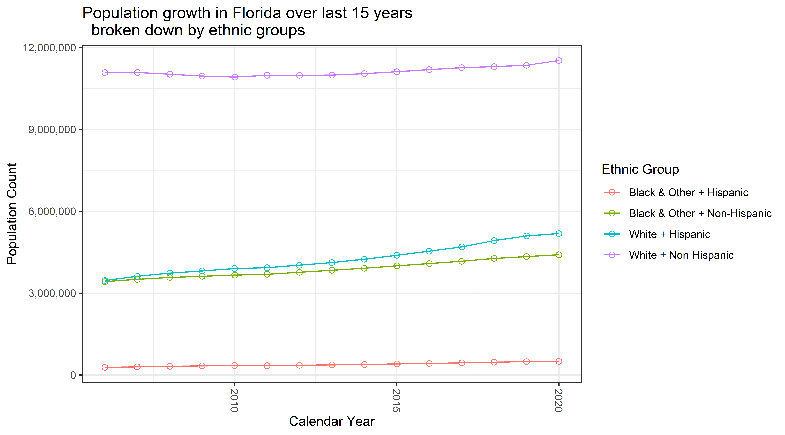

# Abstract

This blogposts shows how to extract population estimates data reported by the Florida Department of Health, prepare them for analysis, and conduct basic exploration of the demographic growth. Read the post [here](http://andriy.rbind.io/post/2020-03-27-florida-demographic-growth/)

# Data Origin
The initial extract of the data was obtained from [www.flhealthcharts.com](http://www.flhealthcharts.com/FLQUERY/Population/PopulationRpt.aspx) a reporting tool for population counts estimated by the Florida Department of Health. The figure below shows the modifications to the default query the produces the data product used in this demonstration:  

The reporting tool gives the option to save the product of the query as an Excel book. This file is the raw source for the current report and can be dowloaded for closer inspection [here](https://github.com/dss-hmi/suicide-prevention-2019/raw/3ff78365931214e342640523f2096c2eac443b2f/analysis/blogposts/florida-demographic-growth/data/FloridaPopulation.xlsx). 

The structure of the Excel file requires some tidying to enable a nimble analytic flow

The blogpost shows how these data are cleaned, prepared for analyses and explored.

