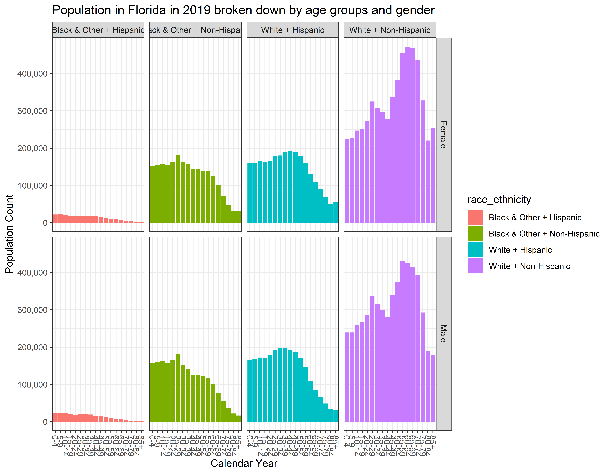

# Abstract

This blogposts shows how to extract population estimates data reported by the [Florida Department of Health](http://www.flhealthcharts.com/FLQUERY/Population/PopulationRpt.aspx) and prepare them for analysis, specifically, for exploring the trends in demographic growth between 2006 and 2020. Read the post at [http://andriy.rbind.io/post/2020-03-27-florida-demographic-growth/](http://andriy.rbind.io/post/2020-03-27-florida-demographic-growth/)

# Data Origin
The initial extract of the data was obtained from [www.flhealthcharts.com](http://www.flhealthcharts.com/FLQUERY/Population/PopulationRpt.aspx) a reporting tool for population counts estimated by the Florida Department of Health. 

The blogpost shows how these data are cleaned, prepared for analyses and explored.

