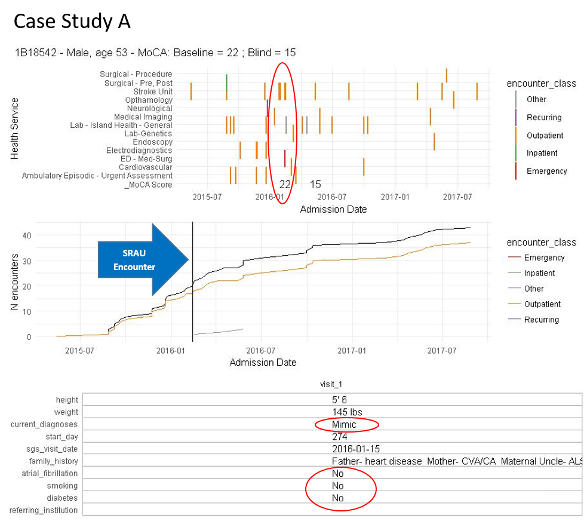

<!-- # Publication type. -->
<!-- # Legend: -->
<!-- # 0 = Uncategorized -->
<!-- # 1 = Conference proceedings -->
<!-- # 2 = Journal -->
<!-- # 3 = Work in progress -->
<!-- # 4 = Technical report -->
<!-- # 5 = Book -->
<!-- # 6 = Book chapter -->

The Data Science Studio (DSS) was formed to promote sound practices of longitudinal modeling in health research and facilitate collaboration between academic researchers and health sytem organizations. This working group was conceived and launched by Ken Moselle, Scott Hofer, and Andriy Koval.  

In fall 2014, Scott Hofer organized a [colloquium series][colloquiumF14] at the [Institute on Aging and Lifelong Health][ialh] - then “Centre on Aging” -  with focus on reproducible methods and applications in aging research. Andriy Koval, his new postdoc at the time, volunteered to give a series of talks on the use of R and common techniques of reproducible analytics with dynamic documents. Ken Moselle, Enterprise Information Architect at [Island Health][viha], attended these lecture series, seeking ways to tap into statistical expertise of UVic to nurse analytical capacities of Island Health. A unique, cross-continuum Electronic Health Records (EHR) system of Island Health has been amassing records since 2007, capturing an almost complete longitudinal picture of patients within the health system. 

However, despite the allure of their interoperability, the system’s software ability to share and make use of data, and longitudinal nature, these data did not contribute much to the evidentiary basis of existing policies. Their broad, cross-continuum spectrum of health services and highly complex statistical models needed to handle _within-person-over-time_ patterns was calling for analytic capacities beyond the scope of Quality Improvement departments within Island Health. The [Fall 2014 colloquium][colloquiumF14] sparked a vision for a working group that would bring together the expertise capable of releasing the potential of big, cross-continuum EHR for aging research: knowledge of clinical context (Ken), statistical expertise in modeling individual differences (Scott) and applied data science skills for handling big data (Andriy).

In the Fall of 2015, Ken formed an [Applied Clinical Research Unit][github_acru] (ACRU) at Island Health. Scott funded Andriy to join this group half-time to work on rendering Island Health’s EHR into a form that can be analyzed and linked to the aging data collected by IALH. Ken and Andriy developed a [Clinical Context Coding Scheme (CCCS)][cccs_github], a system for reducing the granularity of Island Health service landscape. One of the first applications of CCCS was development of “patient timelines” for DEPiCTS projects, co-chaired by Scott, which visualized service utilization in the longitudinal context of visiting the Stroke Rapid Assessment Unit (Figure 1).

Building on this methodology, Andriy and Ken developed a research proposal for developing a severity scaling method for Mental Health and Substance Use (MHSU) conditions based on the service utilization data of Island Health, which [won][award] Andriy a Canadian Institutes of Health Research ([CIHR][cihr]) Health System Impact [Fellowship][fellowship] with BC [Observatory][observatory]  for Population and Public Health of the BC [Centre for Disease Control][bccdc]

Since Fall of 2017, in partnership with the Observatory for Population and Public Health of BCCDC, Ken, Scott, and Andriy launched a series of regular meetings at IALH, providing a forum for UVic researchers and Island Health analysts, program leaders, and administrators. The name of the working group was chosen to highlight the three aspects of service that Data Science Studio aimed to provide. Ken helps with the protocol submission and navigation within the service landscape of Island Health (Data). Scott advises on the longitudinal methodology and aging research (Science). Andriy promotes skills of reproducible analytics, intelligent programming, and data visualisation (Studio).  The first season culminated in the Institute’s colloquium series on [“Displaying Health Data”][colloquiumF18] in November 2018, where DSS showcased latest activities and hosted visiting scholars from University of Central Florida and University of Oklahoma.  

[viha]:https://www.islandhealth.ca/
[github_acru]:https://github.com/IHACRU
[cccs_github]:https://github.com/IHACRU/clinical-context-coding-scheme
[colloquiumF14]:http://ialsa.github.io/COAG-colloquium-2014F/ 
[colloquiumF18]:https://github.com/dss-ialh/displaying-health-data 
[ialh]:https://www.uvic.ca/research/centres/aging/
[award]:http://www.newswire.ca/news-releases/minister-ginette-petitpas-taylor-announces-a-58-million-investment-in-programs-to-give-health-research-trainees-hands-on-work-experience-649094743.html
[fellowship]:http://www.cihr-irsc.gc.ca/e/50268.html
[observatory]:http://www.bccdc.ca/our-services/programs/bc-observatory-for-pop-public-health
[bccdc]:http://www.bccdc.ca/
[cihr]:http://www.cihr-irsc.gc.ca/
