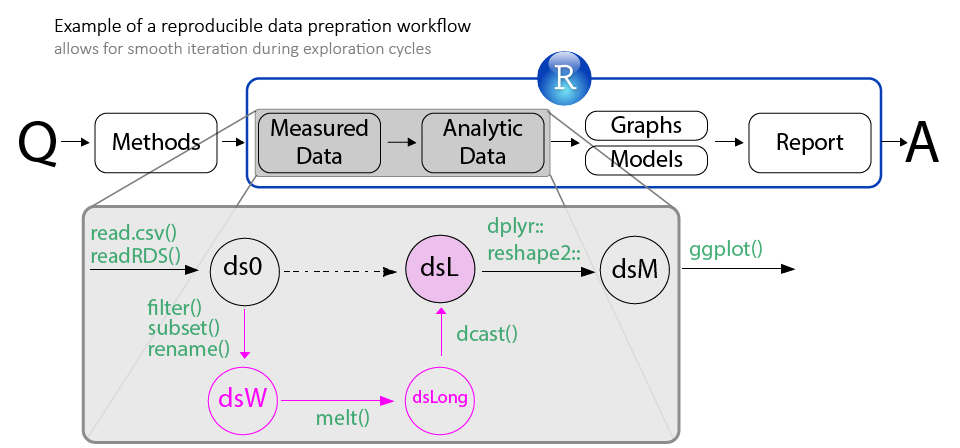

<!-- # Publication type. -->
<!-- # Legend: -->
<!-- # 0 = Uncategorized -->
<!-- # 1 = Conference proceedings -->
<!-- # 2 = Journal -->
<!-- # 3 = Work in progress -->
<!-- # 4 = Technical report -->
<!-- # 5 = Book -->
<!-- # 6 = Book chapter -->

The lecture introduces reproducible research and demonstrates digital self-publishing with RStudio and Git (Hub). The skills described and emphasized in this workflow include data manipulation, graph production, statistical modeling, and dynamic reporting. A series of four talks discusses each skill and gives examples of possible implementations in R.

Of specific importance is the data grooming stage, which enables a productive exploration of the data and establishes custody chains to support research conclusions based on the analytic products. 

